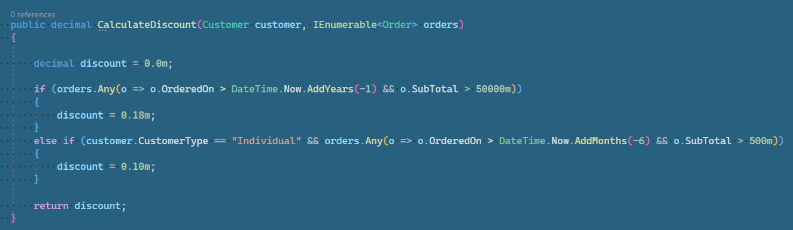
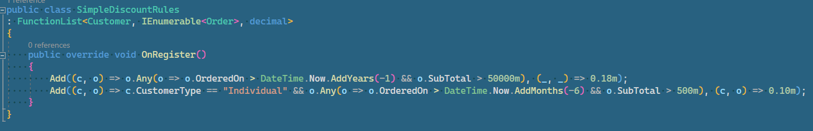
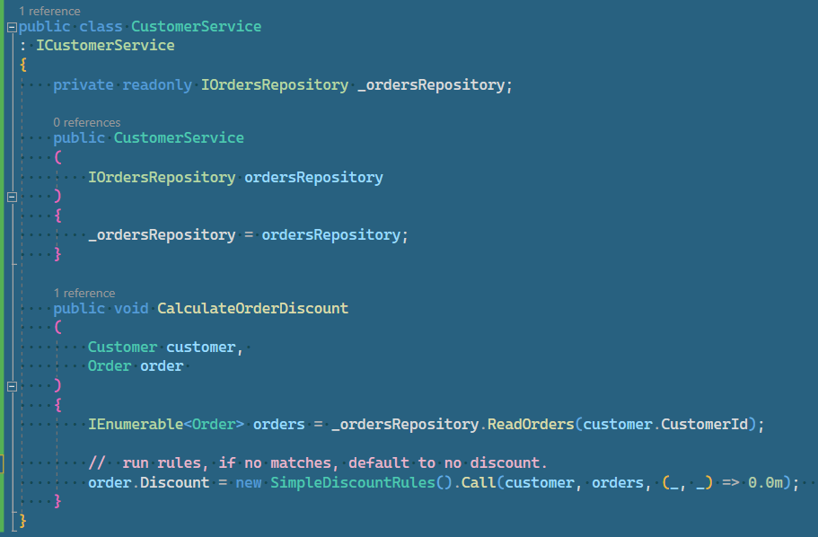
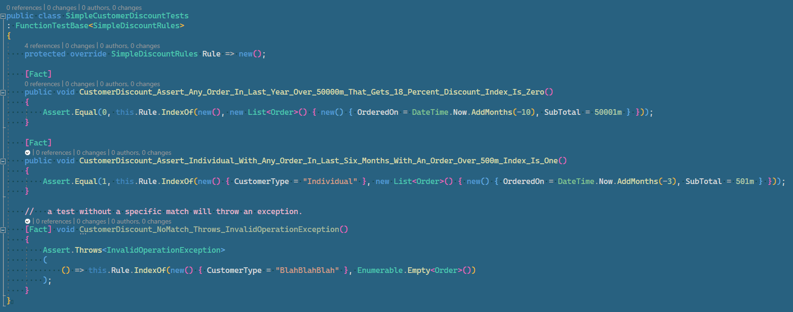

# Bytz.Collections.Dispatch

## Issue

If-then-else blocks are cumbersome and also require a lot of repetitive executions by a developer and qa testing time in order to troubleshoot.   

Being able to consolidate conditions (rules) into a testable container would increase software product quality without ever calling any method call or function return.

## Goals

  * Have more concise expression of boolean conditons.
  * Simpify understanding of boolean conditons to programmers conversant with LinQ expressions.
  * Allow testing of boolean conditions without executing code that may call complex calculations, make calls to databases, etc.
  
## Benefits

* Conciseness of the definition of if-then-else conditions.
* Ability to test  logical branching without having to create dependent instance trees.
* Potential performance increases could be attained by the _order_ that conditions are defined.

## A Customer Order Discount Examples

A simple example of a calculation involving customer discounts follows is as follows:

* If the customer has any order over 50K in the last year, they get a discount of 18%.
* If an "individual" customer has an order within the last six months over $500, they get a 10% discount

### Implementation as If-Then-Else

 ### Implementation within a Dispatch Function-List
 

### Calling of the Dispatch Function-List
A fairly simple example of calling a dispatch list of functions could be where a customer is checking-out to calculate a discount for the current order.

### Testing

Since the "rules" are defined in a FunctionList, we can validate that our indexes are as expectd by testing with various inputs.

